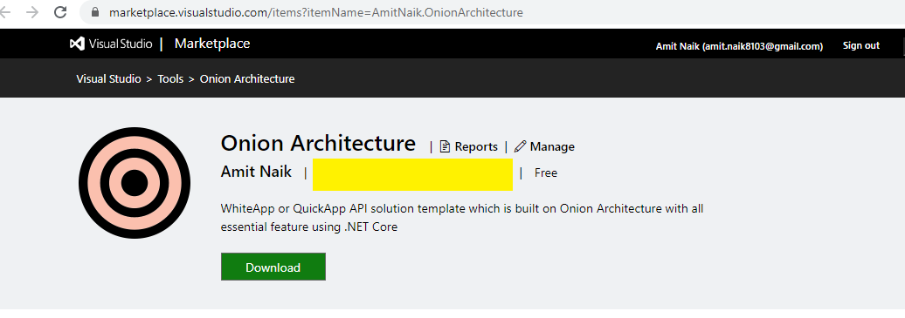
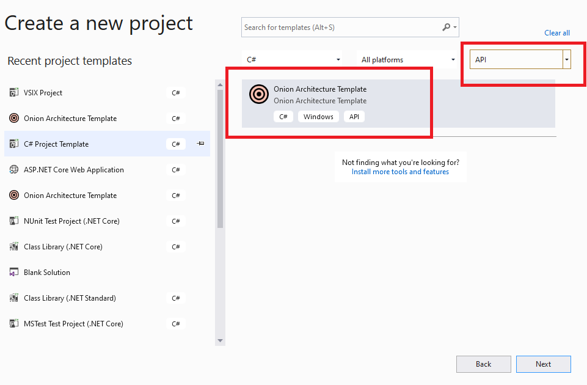
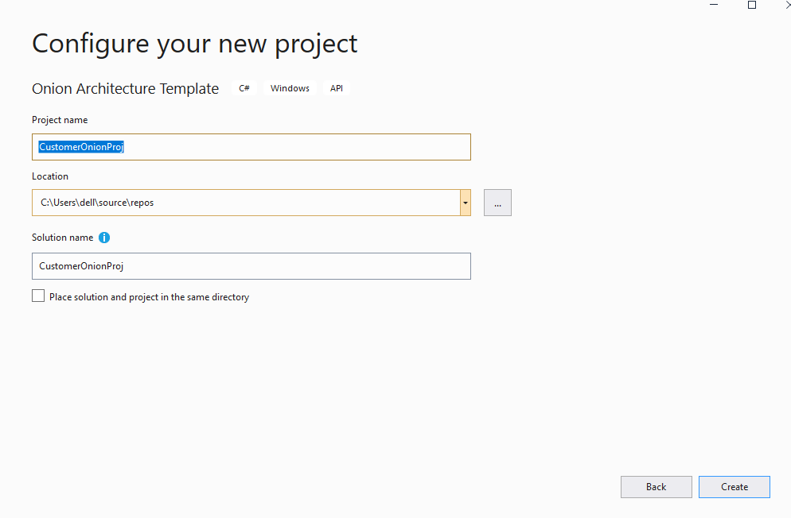
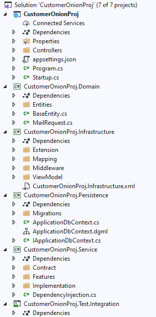

[](https://marketplace.visualstudio.com/items?itemName=AmitNaik.OnionArchitecture)
[](https://marketplace.visualstudio.com/items?itemName=AmitNaik.OnionArchitecture)
[](https://marketplace.visualstudio.com/items?itemName=AmitNaik.OnionArchitecture)
[](https://marketplace.visualstudio.com/items?itemName=AmitNaik.OnionArchitecture)

# WhiteApp/QuickApp Onion architecture with ASP.NET Core

<br />
<p align="center">
  <a href="#">
    
  </a>

  <h3 align="center">Onion Architecture</h3>

  <p align="center">
    WhiteApp or QuickApp API solution template which is built on Onion Architecture with all essential feature using .NET Core!
    <br />
    <a href="https://amitpnk.github.io/Onion-architecture-ASP.NET-Core/"><strong>Explore the docs »</strong></a>
    <br />
    <br />
    <a href="https://marketplace.visualstudio.com/items?itemName=AmitNaik.OnionArchitecture">Download from Marketplace</a>
    ·
    <a href="https://github.com/Amitpnk/Onion-architecture-ASP.NET-Core/issues">Report Bug</a>
    ·
    <a href="https://github.com/Amitpnk/Onion-architecture-ASP.NET-Core/issues/new">Request Feature</a>
  </p>
</p>

## Give a Star! :star:
If you like or are using this project to learn or start your solution, please give it a star. Thanks!

<!-- TABLE OF CONTENTS -->
## Table of Contents

* [Onion Architecture](#Onion-Architecture)
  * [reference](#reference)
* [About the Project](#about-the-project)
  <!-- * [Built With](#built-with) -->
* [Getting Started](#getting-started)
  <!-- * [Prerequisites](#prerequisites)
  * [Installation](#installation) -->
* [Features available in this project](#Features-available-in-this-project)
* [Design patterns Used](#roadmap)
* [Contributing](#contributing)
* [Licence Used](#Licence-Used)
* [Contact](#contact)
<!-- * [Acknowledgements](#acknowledgements) -->

## Onion Architecture

Onion Architecture was introduced by Jeffrey Palermo to provide a better way to build applications in perspective of better testability, maintainability, and dependability on the infrastructures like databases and services

Onion, Clean or Hexagonal architecture: it's all the same. Which is built on Domain-Driven Desgin approach.

Domain in center and building layer top of it. You can call it as Domain-centric Architecture too.

### Reference

* [It's all the same (Domain centeric architecture) - Mark Seemann](https://blog.ploeh.dk/2013/12/03/layers-onions-ports-adapters-its-all-the-same/)
* [Onion Architecture by Jeffrey Palermo](https://jeffreypalermo.com/2008/07/the-onion-architecture-part-1/)
* [Clean Architecture by Robert C. Martin (Uncle Bob)
](https://blog.cleancoder.com/uncle-bob/2012/08/13/the-clean-architecture.html)
* [Hexagonal Architecture by Dr. Alistair Cockburn](https://alistair.cockburn.us/hexagonal+architecture)

## About The Project

<!-- [![Product Name Screen Shot][product-screenshot]](https://example.com) -->

WhiteApp or QuickApp API solution template which is built on Onion Architecture with all essential feature using .NET Core.


## Getting Started

### Step 1: Download extension from project template

   <p> <a href="https://marketplace.visualstudio.com/items?itemName=AmitNaik.OnionArchitecture">Download from Marketplace</a></p>



### Step 2: Create Project

Select project type as API, and select Onion Architecture



### Step 3: Select Onion Architecture project template

Select project type as API, and select Onion Architecture



### Step 4: Project is ready



### Step 5: Create Database

For Code First approach

```sh
Update-Database
```

For Database First approach

In Package Manager console in *<< ProjectName >>.Data*, run below command

```sh
scaffold-dbcontext -provider Microsoft.EntityFrameworkCore.SqlServer -connection "Data Source=(local)\SQLexpress;Initial Catalog=OnionArchitectureDBS;Integrated Security=True"
```

### Step 6: Build and run application 

Swagger UI


## Features available in this project

This is default white application for ASP.NET Core API development

This whiteapp contains following features, uncheck feature need to implement yet. 

- [x] Application is implemented on Onion architecture
- [x] API
- [x] Entityframework Core
- [x] Expection handling
- [x] Automapper
- [x] Unit testing via NUnit
- [x] Integration testing via NUnit
- [ ] Versioning
- [x] Swagger
- [ ] Loggings - seriLog

Below features will be implemented in infrastructure layer. You can plug and play based on your project.

- [ ] JWT authentication
- [ ] React-redux for UI
- [ ] Health checks
- [ ] Fluent validations
- [ ] Hangfire
- [ ] Email
- [ ] Advanced Pagination
- [ ] CQRS Pattern 
<!-- - [ ] SignalR -->

## Licence Used
[![MIT License][license-shield]][license-url]

See the contents of the LICENSE file for details


## Support This Project

If you have found this project helpful, either as a library that you use or as a learning tool, please consider buying me a coffee:

<a href="https://www.buymeacoffee.com/amitpnaik" target="_blank"></a>

I do coding for fun during leisure time, but I have to pay the bills, so I also work for money :P  

[license-shield]: https://img.shields.io/badge/License-MIT-yellow.svg
[license-url]: https://github.com/Amitpnk/Onion-architecture-ASP.NET-Core/blob/master/LICENSE.txt